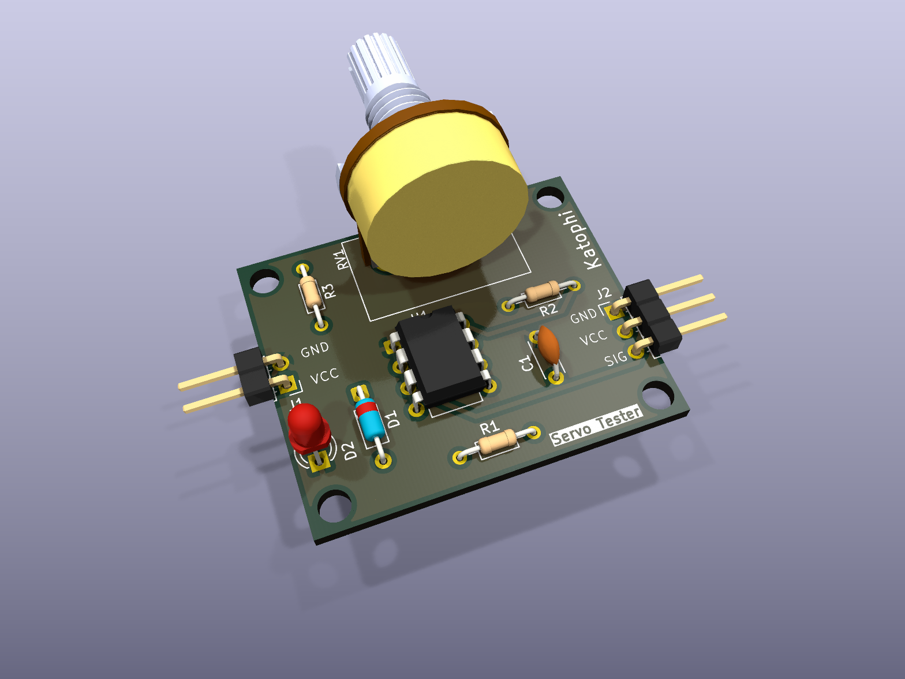

# Servo Tester

A 2-layer PCB that exercises an RC servo without a microcontroller: an NE555 astable
generates the servo pulse train, and a 100 kΩ potentiometer sweeps the pulse width to
drive the horn across its full travel. Designed in KiCad 9.

